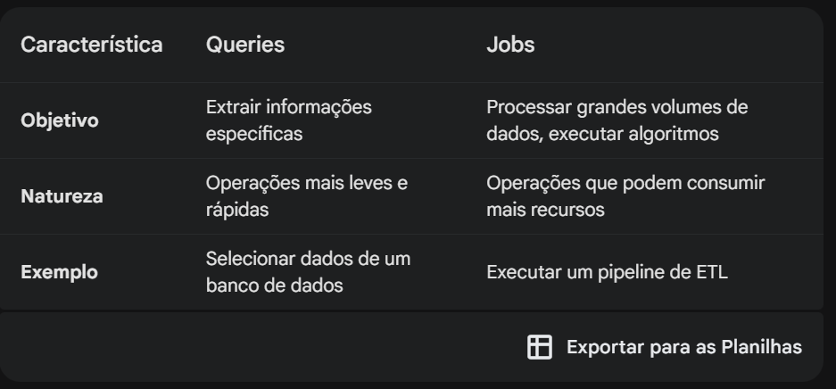

A distinção entre a presença de rótulos e tags em queries e jobs no BigQuery se deve à natureza e ao propósito de cada um.

**Queries**:

Natureza interativa: Queries são executadas de forma interativa, permitindo que você explore seus dados de maneira flexível.
Contexto específico: Os rótulos e tags em queries fornecem um contexto imediato para a consulta em execução. Por exemplo, você pode usar rótulos para identificar o ambiente (desenvolvimento, produção) ou o proprietário da consulta.
Flexibilidade: A capacidade de adicionar rótulos e tags às queries permite que você personalize e categorize suas análises de acordo com suas necessidades específicas.

**Jobs**:

Natureza programada: Jobs são geralmente executados de forma programada ou agendada, com menos interação direta do usuário.
Foco em resultados: O objetivo principal de um job é produzir um resultado específico, como carregar dados, executar uma transformação ou gerar um relatório.
Gerenciamento de recursos: Rótulos e tags podem ser aplicados aos recursos do BigQuery (datasets, tabelas) que são utilizados pelos jobs, mas não diretamente aos jobs em si. Isso permite que você gerencie os custos e o uso de recursos com base nessas informações.

Em resumo:

*Queries*: Os rótulos e tags em queries fornecem um contexto imediato para a análise e permitem uma maior flexibilidade na exploração dos dados.
*Jobs*: Os rótulos e tags são aplicados aos recursos utilizados pelos jobs, permitindo um melhor gerenciamento e organização dos seus recursos.
Por que essa distinção?

Nível de granularidade: As queries são mais granulares e permitem um nível de detalhamento maior. Os jobs, por outro lado, representam uma unidade de trabalho mais abrangente.
Propósito: Queries são para exploração e análise, enquanto jobs são para execução de tarefas.
Quando usar rótulos e tags:

Queries: Utilize rótulos e tags para categorizar suas consultas, identificar o ambiente, o proprietário e outras informações relevantes.
Jobs: Aplique rótulos aos recursos utilizados pelos jobs para gerenciar custos, rastrear o uso e aplicar políticas de acesso.
Exemplo:

Imagine que você tem um dataset com dados de vendas. Você pode criar um rótulo chamado "ambiente" e atribuir os valores "desenvolvimento" e "produção" aos seus datasets. Em seguida, você pode criar uma query com o rótulo "análise_mensal" para analisar as vendas do mês anterior. Ao executar essa query, você saberá imediatamente que se trata de uma análise mensal em um ambiente de desenvolvimento.

Em conclusão, a ausência de rótulos e tags diretamente nos jobs não significa que eles não sejam importantes. Ao aplicar rótulos aos recursos utilizados pelos jobs, você obtém um controle e uma visibilidade mais eficientes sobre seus processos de análise de dados.

**Exemplos de Uso**:

Ambiente: environment=production, environment=staging
Proprietário: owner=john.doe, owner=data_team
Equipe: team=data_engineering, team=marketing
Projeto: project=my_project
Custo: cost_center=1234, billing_account=5678
Criação: created_by=system, created_by=user
Status: status=active, status=archived

**Jobs**

https://cloud.google.com/bigquery/docs/running-jobs?hl=pt_br

https://cloud.google.com/bigquery/docs/adding-labels?hl=pt-br#job-label

bq query 
--label department:shipping 
--nouse_legacy_sql 
'SELECT client_id, channel  
FROM `sapient-cycling-434419-u0.Campaigns.Campaigns` '

bq query 
--label department:shipping 
--nouse_legacy_sql '
SELECT client_id, channel
FROM `sapient-cycling-434419-u0.Campaigns.Campaigns`
WHERE channel = "sms"
ORDER BY client_id
LIMIT 5
'

**Para adicionar um label a um job**
comando bq query com a sinalização --label. Para adicionar vários rótulos, repita a sinalização. A sinalização --nouse_legacy_sql indica que sua consulta está na sintaxe do GoogleSQL.

- bq query --label KEY:VALUE --nouse_legacy_sql 'QUERY'

Exemplo:
    bq query \
    --label department:shipping \
    --nouse_legacy_sql \
    'SELECT
       column1, column2
     FROM
       `mydataset.mytable`'

**Tags**
https://cloud.google.com/resource-manager/docs/tags/tags-creating-and-managing?hl=pt-br

from google.cloud import bigquery

client = bigquery.Client()

query_job = client.query(
    """
    SELECT client_id, channel
    FROM `sapient-cycling-434419-u0.Campaigns.Campaigns`
    WHERE channel = "sms"
    ORDER BY client_id
    LIMIT 5
    """,
    labels={'channel': 'sms'}
)

results = query_job.result()
for row in results:
    print(f"client_id: {row['client_id']}, channel: {row['channel']}")